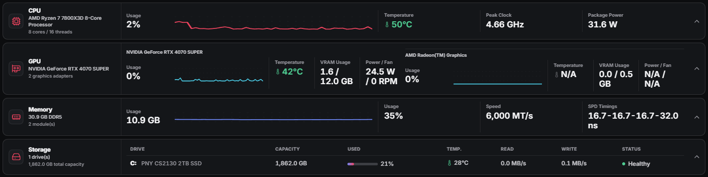
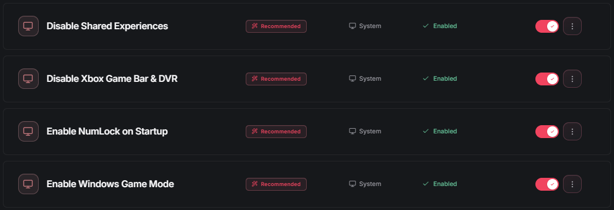
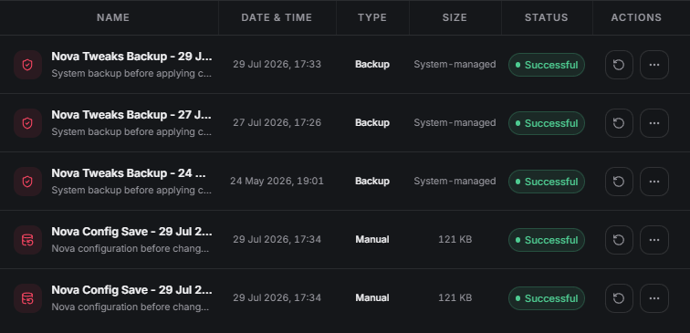
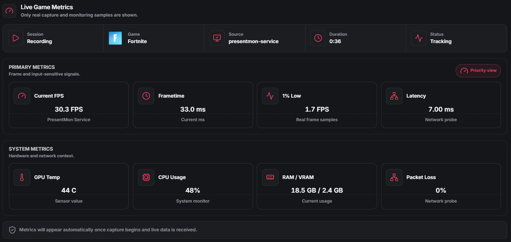

# Nova Tweaks

Free and open-source Windows system configuration utility with documented tweaks, local monitoring, backup tools, and user-controlled changes.

[Download](https://github.com/NovaTweaksDev/Nova-Tweaks/releases) | [Website](https://nova-tweaks.com) | [Report a bug](https://github.com/NovaTweaksDev/Nova-Tweaks/issues/new?template=bug_report.yml) | [Request a feature](https://github.com/NovaTweaksDev/Nova-Tweaks/issues/new?template=feature_request.yml) | [Contribute](CONTRIBUTING.md)

[](https://github.com/NovaTweaksDev/Nova-Tweaks/actions/workflows/ci.yml)
[](LICENSE)
[](#requirements)
[](https://github.com/NovaTweaksDev/Nova-Tweaks/releases)



Nova Tweaks is an Electron desktop application for people who want to inspect and change selected Windows settings without hiding the underlying operation. Tweak metadata describes the intended action, compatibility, risk, and whether administrator access or a restart is required. The source, tweak definitions, PowerShell scripts, and Nova-owned helper source are available in this repository.

Nova Tweaks does not guarantee higher frame rates, lower latency, or improved performance. Results depend on the device, Windows configuration, drivers, and workload. Review each change and its warnings before applying it.

## Features

- Documented Windows tweaks with state detection, risk labels, compatibility notes, and apply or restore actions where supported
- Local configuration backups, Windows restore-point actions, scheduled backups, and restore history
- Hardware overview and optional Advanced Sensors integration through LibreHardwareMonitor
- Installed application and startup-entry management
- Scheduled maintenance and traceable process-based automation rules
- Game detection, session recording, frame metrics through PresentMon, and temporary game-session controls
- Network diagnostics, including an optional extended test and reversible MTU changes
- Local settings, diagnostics export, and tweak action logs
- English, German, and French interfaces

Availability can depend on hardware, Windows edition, permissions, and bundled helper support.

## Screenshots

### Tweaks



### Backup and restore



### Session monitoring



Screenshots show real application views used by the official website. The interface may vary between releases.

## Safety and transparency

Nova Tweaks starts without administrator rights. It requests elevation only when an explicit operation needs it, using a restricted administrator broker for supported privileged actions. Tweak definitions and their PowerShell implementations are bundled with the application so that changes can be reviewed in this repository.

Supported tweak operations create local Nova configuration snapshots before changes are applied, and the Backup and Restore area also provides manual backup and Windows restore-point actions. Not every system action is reversible, and a Nova backup is not a substitute for a tested system or file backup.

Release workflows publish SHA-256 checksums with installers. The build and test suite include checks for bundled tweak metadata, helper integrity configuration, Electron packaging boundaries, and third-party component records. Source availability and these checks improve reviewability, but they are not a security guarantee.

Windows configuration changes can affect stability, compatibility, security, power use, networking, and application behavior. Read the description and warnings for each change, and test sensitive changes on a non-critical system or a recoverable environment.

## Privacy and network access

The current public build has no Nova account requirement and does not collect Nova telemetry, analytics, or usage data. Settings, backups, automation state, session reports, and application logs are stored locally.

Network access is limited to features that need an external destination:

- Release information is obtained from the public GitHub Releases API when the application requests release details.
- The user-started Extended Network Test downloads and uploads generated test bytes through `speed.cloudflare.com`. It also performs DNS and connectivity probes. Cloudflare receives the connection's public IP address and normal request metadata. No personal files are uploaded.
- Links to the website, GitHub, support, and documented third-party sources open in the default browser or mail application after destination validation.

See the [website privacy policy](https://nova-tweaks.com/privacy) and [Cloudflare privacy policy](https://www.cloudflare.com/privacypolicy/) for the external services involved.

## Download

Download the current installer from [GitHub Releases](https://github.com/NovaTweaksDev/Nova-Tweaks/releases). GitHub's automatically generated source ZIP and tarball contain source code, not the Windows installer.

Current Windows installers are unsigned. Windows can therefore display an `Unknown publisher` warning. Use only releases published by `NovaTweaksDev`, compare the installer against the included `checksums.txt`, and review the release notes before installation.

Nova Tweaks does not currently use a SignPath Foundation certificate. See [SIGNPATH.md](SIGNPATH.md) for the current status and technical preparation record.

## Requirements

### End users

- Windows 10 or Windows 11
- x64 processor and operating system
- Administrator access for operations that change protected Windows settings

Hardware monitoring, game capture, and device-specific tweaks depend on compatible hardware and drivers.

### Developers

- Windows 10 or Windows 11
- Node.js 22 and npm
- PowerShell
- Visual Studio Build Tools with C++ and CMake support for Nova-owned native helpers
- .NET 8 SDK when rebuilding the game detector or LibreHardwareMonitor runtime

The checked-in lockfile is used for reproducible npm installs. Some helper and packaging tasks are Windows-specific.

## Development

```powershell
npm ci
npm run dev
```

Run the existing validation and packaging commands with:

```powershell
npm test
npm run build
npm run dist:local
```

`npm run dist:local` creates an unsigned x64 installer in `dist-release/`. It is intended for local testing and does not publish a release.

## Project structure

- `src/` - React interface, local content, and renderer-side services
- `electron/` - Electron main process, preload bridge, security boundaries, and Windows integrations
- `resources/` - tweak definitions, PowerShell scripts, monitoring source, and reviewed runtime resources
- `tools/` - source for Nova-owned native helper programs
- `scripts/` - build, packaging, vendoring, checksum, and verification scripts
- `locales/` - English, German, and French interface translations
- `.github/` - CI, preview, release, and community configuration

## Contributing

Bug fixes, documentation, tests, translations, accessibility improvements, and focused compatibility work are welcome. You do not need to understand the entire application to make a useful contribution.

Read [CONTRIBUTING.md](CONTRIBUTING.md) before opening a pull request.

- [Report a bug](https://github.com/NovaTweaksDev/Nova-Tweaks/issues/new?template=bug_report.yml)
- [Request a feature](https://github.com/NovaTweaksDev/Nova-Tweaks/issues/new?template=feature_request.yml)
- [Open pull requests](https://github.com/NovaTweaksDev/Nova-Tweaks/pulls)

## Security

Do not report suspected vulnerabilities in a public issue. Follow the private reporting guidance in [SECURITY.md](SECURITY.md).

## Third-party software

Nova Tweaks bundles third-party components under their own license terms. These components are not presented as Nova Tweaks-owned code, and their original notices remain part of the distribution.

See [THIRD-PARTY-NOTICES.md](THIRD-PARTY-NOTICES.md) for component versions, origins, source information, licenses, and recorded SHA-256 hashes.

## License and trademarks

Nova Tweaks is licensed under [GPL-3.0-only](LICENSE). The Nova Tweaks name, logo, and related brand identifiers are governed separately by [TRADEMARKS.MD](TRADEMARKS.MD).

## Support

Start with [SUPPORT.md](SUPPORT.md) for bug reports, feature requests, questions, security issues, and official downloads.

Development is not conditional on financial support. If you want to leave a voluntary tip, the project's public page is [Buy Me a Coffee](https://buymeacoffee.com/novatweaks).
